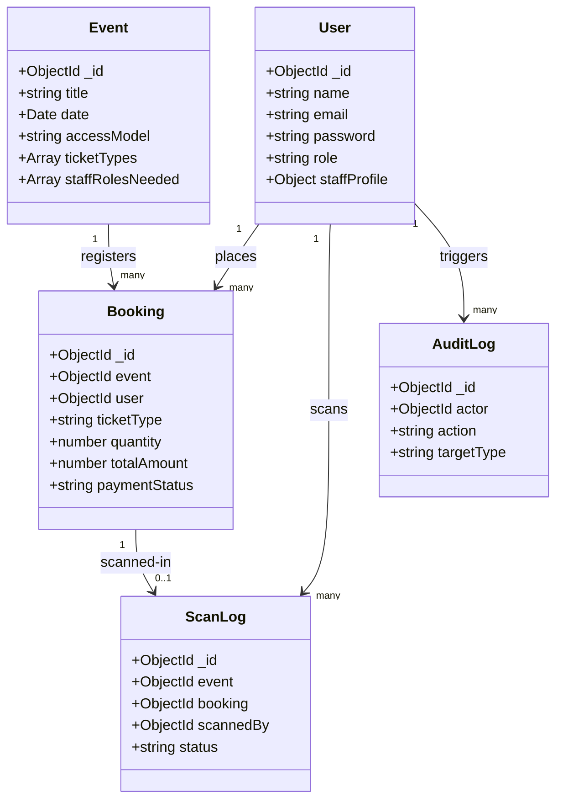

# System Architecture: Event Logix

This document details the architectural layout, pattern decisions, and technical implementations that govern **Event Logix**.

---

## 🏗️ Folder Structure & Route Groups

The application uses **Next.js App Router** with Route Groups to isolate the three portals of the ecosystem under a single codebase and deployment:

```bash
src/app/
├── (admin)/admin/     # restricted suite for event organizers (analytics, rosters, staff onboarding verification)
├── (staff)/staff/     # workforce portal for service providers (shift feed, availability, clock-in, wallet)
├── (public)/          # guest gallery for attendees (discovery, booking checkout, digital tickets)
├── (auth)/            # shared authentication portal (login, signup, onboarding)
├── api/               # serverless endpoints (vercel cron, file uploads)
├── globals.css        # custom tokens and Tailwind configurations
├── layout.tsx         # application root shell
└── proxy.ts           # global middleware proxy (role-based security)
```

By keeping directories isolated with parenthesis (e.g. `(admin)`), Next.js handles route paths (like `/admin/staff` and `/staff/jobs`) independently without routing conflicts, while giving us clean code separation.

---

## 🛡️ Role-Based Access Control (RBAC) & Middleware

Security is enforced at the network edge using Next.js Middleware Proxy:

1. **Authentication Token**: The system uses `jose` to issue custom signed JWT tokens stored securely in user cookies.
2. **Global Redirect Proxy (`src/proxy.ts`)**:
   - Intercepts all incoming requests before page rendering.
   - Decodes the user payload containing the database `role`.
   - **Enforces Security Boundaries**:
     - Redirects non-admin requests attempting to access `/admin/*` routes to `/403`.
     - Redirects non-staff requests attempting to access `/staff/*` routes.
     - Automatically routes authenticated users logging in to their designated portal home.

---

## ⚡ Server Actions Data Layer

The platform utilizes **React 19 Server Actions** for 100% of its form submissions and database writes:

- **Location**: Located in `src/lib/actions/*`.
- **Security**: Actions are flagged with `"use server"` and check user session roles internally before execution.
- **Cache Revalidation**: Calls `revalidatePath` to refresh server-rendered pages instantly upon data mutations without triggering manual page reloads.

---

## 🗄️ Database Schemas & Data Model

We use **MongoDB** via **Mongoose** to maintain typed, high-performance collections:



1. **Defensive Schema Guards**: Models include defaults and array fallbacks to prevent crash loops when dealing with legacy documents or schema drifts.
2. **Geospatial Indexing**: The `Event` model indexes coordinate coordinates (`2dsphere`) to support geolocation radius matching for staff shift clock-ins.
